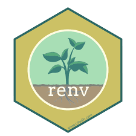
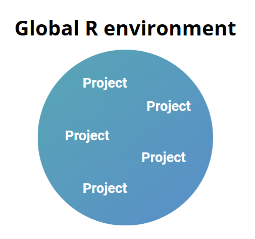
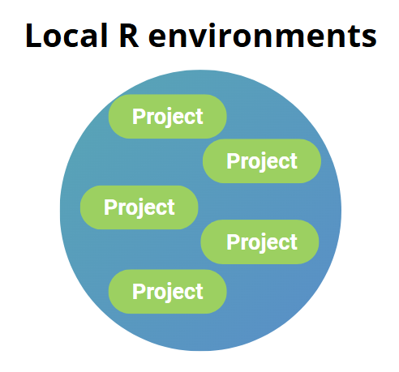
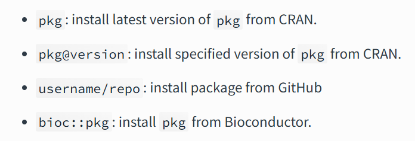
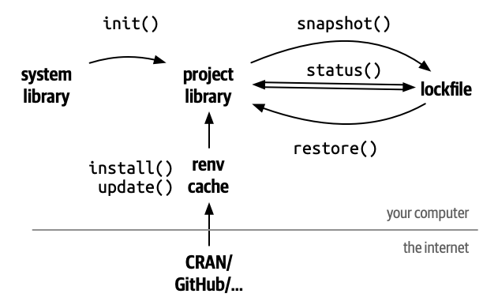

### Making R projects reproducible, portable, and stable

---

## 📌 What is `renv`?

- A dependency management system for R.
- Tracks packages used in your R project.
- Creates isolated, project-specific library environments.
- Ensures consistent package versions across systems and time.

---

<div style="display: flex; justify-content: center; align-items: center; gap: 20px;">

  
  

</div>

---

## 🚀 Important tools in `renv`

---

## 🔧 `renv::init()`

- Initializes a new project environment.
- Creates a **project-specific library**.
- Automatically installs and tracks current packages.

```r
renv::init()
```

---

## 🔧 `renv::status()`

- Shows the status of your project library.
- Tells you if packages are out-of-sync with the lockfile.

```r
renv::status()
```

---

## 🔧 `renv::install()`

- Installs a package into the project library.
- Tracked automatically by renv.

```r
renv::install("ggplot@3.16.0")
```



---

## 🔧 `renv::snapshot()`

- Captures the current state of your project library.
- Saves it in `renv.lock`.

```r
renv::snapshot()
```

---

## 🔧 `renv::restore()`

- Restores the project environment using the `renv.lock` file.

- Ensures package versions are consistent on your new environment.

```r
renv::restore()
```

---

# Annex

<div style="display: flex; justify-content: center; align-items: center;">
  
</div>