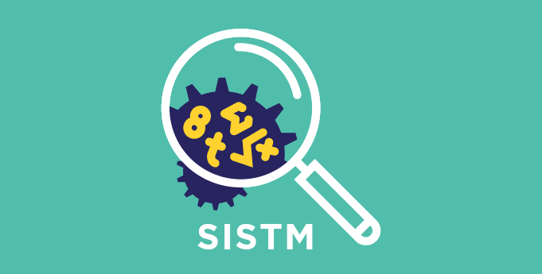

  “Reproducible research is not a luxury—it’s a necessity.” 

---

    
    

---

> A 3-part hands-on workshop series hosted at **BPH – Bordeaux Population Health**, animated by [Jad El Karchi](https://www.linkedin.com/in/jad-el-karchi/), to empower you to write **reproducible**, **deployable**, and **maintainable** R code.

---

## 🔗 Quick Navigation

- [🏠 Home](./README.md)
- [🧪 Workshop 1: Renv](./ws1-renv.md)
- [📦 Workshop 2: R Package](./ws2-rpackage.md)
- [🛠️ Workshop 3: GitHub](./ws3-github.md)

---

## 📚 Workshop Series Overview

<table>
  <tr>
    <th>Workshop</th>
    <th>Description</th>
    <th>Link</th>
  </tr>
  <tr>
    <td>🧪 <b>Renv</b></td>
    <td>Create a seamless R environment for reproducibility</td>
    <td><a href="./ws1-renv.html"><strong>→ Go to WS 1</strong></a></td>
  </tr>
  <tr>
    <td>📦 <b>R Package</b></td>
    <td>Package and share your R code for reuse and collaboration</td>
    <td><a href="./ws2-rpackage.html"><strong>→ Go to WS 2</strong></a></td>
  </tr>
  <tr>
    <td>🛠️ <b>GitHub</b></td>
    <td>Use GitHub for versioning, collaboration, and deployment</td>
    <td><a href="./ws3-github.html"><strong>→ Go to WS 3</strong></a></td>
  </tr>
</table>

---

## 🎯 Objectives

By the end of this workshop series, you'll be able to:

- Build portable and reproducible R environments using `renv`
- Create and document your own R packages
- Use Git and GitHub for source control and project deployment

---

## 🧰 Explore the Tools

---

## 👨‍💻 About the Author

I'm **Jad El Karchi**, a software engineer and AI researcher.  
I help research teams improve the **reproducibility, sharing, and deployment** of their scientific code.

🔗 [More about me →](https://www.linkedin.com/in/jad-el-karchi/)
