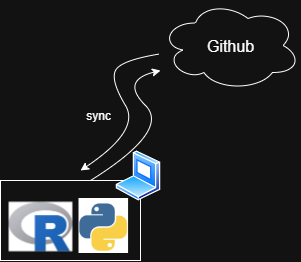

# 🚀 Introduction to GitHub  
### A Beginner-Friendly Course  
*Version Control, Collaboration, and Open Source*

---

## 📌 Course Overview

- What is Git & GitHub?
- Setting up GitHub
- Git Basics: Clone, Commit, Push
- Branching & Merging
- Best Practices

---

## 🔍 What is Git?

- A distributed version control system.
- Tracks changes in source code during software development.
- Created by **Linus Torvalds** in 2005.

🛠️ **Key Features:**
- Snapshots of your project
- Collaboration-friendly
- Fast & lightweight

---

## 🌐 What is GitHub?

- A cloud-based platform for hosting Git repositories.
- Adds social and collaboration features.
- Owned by Microsoft.

🔑 **Why GitHub?**
- Collaboration through Pull Requests
- Open-source community
- Issue tracking and project management

---



---

## 🛠️ Setting Up Git & GitHub

1. Install Git  
   - [git-scm.com](https://git-scm.com)

2. Create a GitHub account  
   - [github.com](https://github.com)

3. Configure Git  
```bash
git config --global user.name "Your Name"
git config --global user.email "you@example.com"
```
---

### 📁 Basic Git Commands

```bash
git clone <repo-url>
git status
git add <file>
git commit -m "message"
git tag 1.0
git push origin main
```

---

### 🌿 Branching & Merging

#### Why Branch?
- Work on features without affecting main
- Easy to experiment


```bash
git branch -d new-branch
git checkout -b new-branch
git merge new-branch
```

--- 
### 🧠 Best Practices
- Write clear commit messages
- Use `.gitignore`
- Create README files
- Keep branches focused
- Regularly pull from main

---
### 📚 Resources
- [GitHub Docs](https://docs.github.com)

- [Git Handbook](https://guides.github.com/introduction/git-handbook/)

- [Pro Git Book](https://git-scm.com/book/en/v2)

--- 
### 🙋 Questions?
